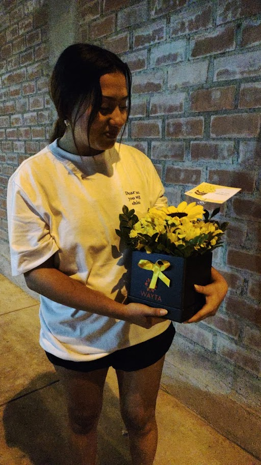

<!DOCTYPE html>
<html lang="es">
<head>
    <meta charset="UTF-8">
    <meta name="viewport" content="width=device-width, initial-scale=1.0">
    <title>Para ti, Andrea 🌸</title>
    
</head>
<body>
    

        ❤️
        💖
        💕
        🌸
        🌹
    

    

    

        <h1>Para ti, Andrea ❤️</h1>
        
        

            
        

        

            
Querida Andrea,

            
            
Hay personas que llegan como el atardecer: despacio, pintando todo de colores que ni sabía que existían. Tú has sido así para mí. Cada conversación, cada risa y hasta esos silencios incómodos, han ido llenando espacios que no sabía que estaban vacíos.

            
"El amor no es mirarse el uno al otro, sino mirar juntos en la misma dirección"

            
No quiero apresurar nada, porque lo que siento es demasiado valioso como para convertirlo en una carrera. Prefiero caminar a tu lado, aprender de tus miedos y celebrar tus alegrías, aunque sea desde donde tú me permitas estar.

            
Estas fotos son solo instantes de todo lo que me gustaría atesorar contigo. No necesito promesas grandiosas, solo la oportunidad de demostrarte que cuando digo "te quiero", es con paciencia, con respeto y con la tranquilidad de que eres libre de sentir (o no) lo mismo.

            
Gracias por existir tal como eres. 
            Con todo mi cariño, 
            José 💖

        

        <footer>
            
Hecho con ❤️ · Cada detalle es para ti, Andrea.

        </footer>
    

    
</body>
</html>
